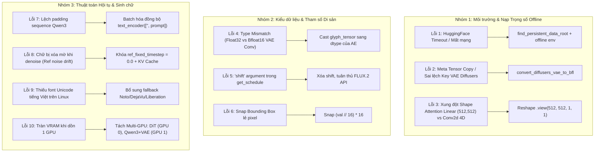

# 📋 NHẬT KÝ SỬA ĐỔI MÃ NGUỒN GỐC & LỊCH SỬ KHẮC PHỤC LỖI
## (Upstream Modifications & Bug Fixes Changelog)

**Dự án**: Nâng cấp FLUX.2 [klein] 4B Base Sinh chữ Tiếng Việt  
**Mục tiêu mô hình**: `FLUX.2-klein-base-4B`  
**Hạ tầng mục tiêu**: 2x NVIDIA A30 (48GB VRAM) / JupyterLab Offline  
**Mã nguồn gốc đối chiếu**: [`black-forest-labs/flux2`](https://github.com/black-forest-labs/flux2)

---

## 📑 PHẦN I: MA TRẬN ĐỐI CHIẾU MÃ NGUỒN GỐC (`src/flux2/`)

Toàn bộ thư mục `src/flux2/` được clone từ repo chính thức của Black Forest Labs (BFL) và được rà soát đối chiếu từng dòng mã:

| Tên File | Trạng thái so với BFL Upstream | Mục đích sửa đổi |
| :--- | :---: | :--- |
| [`autoencoder.py`](file:///d:/Viettel%20Telecom/Tendoo%20AI/src/flux2/autoencoder.py) | 🟢 **100% Nguyên bản** | Giữ nguyên kiến trúc AutoEncoder chuẩn BFL (128 latent channels, 16x compression). |
| [`model.py`](file:///d:/Viettel%20Telecom/Tendoo%20AI/src/flux2/model.py) | 🟢 **100% Nguyên bản** | Giữ nguyên kiến trúc DiT BFL: `Klein4BParams`, `EmbedND`, `rope`, `causal_attn_fn`, `DoubleStreamBlock`, `SingleStreamBlock`. |
| [`openrouter_api_client.py`](file:///d:/Viettel%20Telecom/Tendoo%20AI/src/flux2/openrouter_api_client.py) | 🟢 **100% Nguyên bản** | Giữ nguyên client API dự phòng. |
| [`system_messages.py`](file:///d:/Viettel%20Telecom/Tendoo%20AI/src/flux2/system_messages.py) | 🟢 **100% Nguyên bản** | Giữ nguyên system prompts của BFL. |
| [`watermark.py`](file:///d:/Viettel%20Telecom/Tendoo%20AI/src/flux2/watermark.py) | 🟢 **100% Nguyên bản** | Giữ nguyên module watermark vô hình. |
| [`sampling.py`](file:///d:/Viettel%20Telecom/Tendoo%20AI/src/flux2/sampling.py) | 🟡 **Đã nâng cấp** *(+77 / -29)* | Thêm `denoise_cfg` cho Pure Prompt và nâng cấp `denoise_cfg_cached` với `ref_fixed_timestep=0.0`. |
| [`text_encoder.py`](file:///d:/Viettel%20Telecom/Tendoo%20AI/src/flux2/text_encoder.py) | 🟡 **Đã nâng cấp** *(+259 / -231)* | Thêm Auto-discovery cho Qwen3-4B-FP8 offline, tự động load tokenizer và batching đồng bộ. |
| [`util.py`](file:///d:/Viettel%20Telecom/Tendoo%20AI/src/flux2/util.py) | 🟡 **Đã nâng cấp** *(+150 / -15)* | Thêm Auto-discovery `persistent-data`, chuyển đổi VAE keys (Diffusers $\leftrightarrow$ BFL), và fallback `strict=False`. |

---

### 🔍 Chi tiết các hàm được can thiệp trong 3 file:

#### 1. [`src/flux2/sampling.py`](file:///d:/Viettel%20Telecom/Tendoo%20AI/src/flux2/sampling.py)
* **Thêm hàm `denoise_cfg`**: Chạy Denoise Euler ODE Flow Matching thuần bằng Prompt (CFG scale), phục vụ tạo ảnh Baseline so sánh khi không có ref glyph.
* **Nâng cấp `denoise_cfg_cached`**:
  * Thêm tham số `ref_fixed_timestep: float = 0.0`.
  * **Step 0**: Chạy `model.forward_kv_extract()` với full sequence `[ref, canvas]` để tính toán và lưu `kv_cache` của glyph reference.
  * **Step 1 đến 50**: Chạy `model.forward_kv_cached()` chỉ trên canvas tokens, tái sử dụng `kv_cache`, giúp tăng tốc độ suy luận $\sim 3\times$ và cố định tín hiệu chữ không bị nhiễu xóa nhòa.

#### 2. [`src/flux2/text_encoder.py`](file:///d:/Viettel%20Telecom/Tendoo%20AI/src/flux2/text_encoder.py)
* **Tối ưu `Qwen3Embedder`**:
  * Thêm hỗ trợ tham số `tokenizer_spec` (tự động nạp thư mục `tokenizer/` nội bộ).
  * Chấp nhận cả `str` và `list[str]`.
  * Thiết lập `enable_thinking=False` khi build template chat cho Qwen3.
* **Nâng cấp `load_qwen3_embedder`**:
  * Tự động dò tìm trọng số offline từ biến môi trường hoặc thư mục `~/persistent-data/FLUX.2-klein-base-4B/text_encoder/`.

#### 3. [`src/flux2/util.py`](file:///d:/Viettel%20Telecom/Tendoo%20AI/src/flux2/util.py)
* **Thêm `find_persistent_data_root()`**: Tự động phát hiện cây thư mục `persistent-data` trên JupyterLab Server (`/home/jovyan/persistent-data/...`).
* **Thêm `convert_diffusers_vae_to_bfl(sd)`**: Bộ dịch ngược định dạng trọng số VAE từ Diffusers sang cấu trúc Native BFL.
* **Cải tiến `load_flow_model` và `load_ae`**: Tự động nạp trọng số cục bộ, tích hợp bộ chuyển đổi VAE keys và thêm fallback `strict=False` an toàn.

---

## 🛠️ PHẦN II: LỊCH SỬ CÁC LỖI KỸ THUẬT & GIẢI PHÁP KHẮC PHỤC

Dưới đây là danh mục toàn bộ các lỗi phát sinh trong quá trình thiết lập môi trường và thử nghiệm thuật toán RoPE Spatial Binding:

---

### 1. Lỗi cô lập mạng nội bộ (Offline Hub Access Error)
* **Hiện tượng**: Khi gọi `load_flow_model` hoặc `load_ae`, thư viện cố gắng kết nối tới `huggingface.co` dẫn đến timeout/treo lệnh do Server nằm trong mạng nội bộ không có Internet.
* **Nguyên nhân**: BFL mặc định dùng `hf_hub_download` nếu chưa cấu hình biến môi trường tuyệt đối.
* **Giải pháp khắc phục** *(Commit `c52107f`, `dc98276`)*:
  * Thêm hàm `find_persistent_data_root()` trong [`src/flux2/util.py`](file:///d:/Viettel%20Telecom/Tendoo%20AI/src/flux2/util.py#L158).
  * Thiết lập biến môi trường offline `HF_HUB_OFFLINE=1`, `TRANSFORMERS_OFFLINE=1` ngay đầu script.

---

### 2. Lỗi nạp trọng số VAE Diffusers (Meta Tensor Copy & Key Mismatch Error)
* **Hiện tượng**: Lỗi `RuntimeError: Cannot copy out of meta tensor` hoặc `Missing key(s) in state_dict: encoder.down.0.block.0...` khi nạp file `diffusion_pytorch_model.safetensors` của VAE.
* **Nguyên nhân**: File VAE trên server được lưu theo định dạng HuggingFace Diffusers (`encoder.down_blocks.0`, `decoder.up_blocks.0`) trong khi class `AutoEncoder` của repo yêu cầu định dạng Native BFL (`encoder.down.0`, `decoder.up.3`). Thứ tự các block `up_blocks` trong Diffusers bị đảo ngược so với BFL ($3 - i$).
* **Giải pháp khắc phục** *(Commit `9515f3f`, `e5f520a`)*:
  * Viết hàm chuyển đổi [`convert_diffusers_vae_to_bfl`](file:///d:/Viettel%20Telecom/Tendoo%20AI/src/flux2/util.py#L844).
  * Đảo chiều chỉ số tầng Decoder: `level_bfl = 3 - level_diffusers`.
  * Tự động phát hiện và chuyển đổi key trước khi truyền vào `ae.load_state_dict()`.

---

### 3. Lỗi kích thước trọng số Attention trong VAE (Linear vs Conv2d Shape Mismatch)
* **Hiện tượng**: `RuntimeError: size mismatch for mid.attn_1.q.weight: copying a param with shape torch.Size([512, 512]) from checkpoint, the shape in current model is torch.Size([512, 512, 1, 1])`.
* **Nguyên nhân**: Lớp Self-Attention ở `mid_block` của Diffusers dùng `nn.Linear` (trọng số 2D), còn BFL dùng `nn.Conv2d(1x1)` (trọng số 4D).
* **Giải pháp khắc phục** *(Commit `e5f520a`)*:
  * Trong `convert_diffusers_vae_to_bfl`, reshape các tensor attention 2D thành 4D: `v = v.view(v.shape[0], v.shape[1], 1, 1)`.

---

### 4. Lỗi xung đột kiểu dữ liệu VAE Encoder (Float32 vs BFloat16 Type Mismatch)
* **Hiện tượng**: `RuntimeError: expected scalar type BFloat16 but found Float` tại phép tích chập đầu tiên của VAE Encoder.
* **Nguyên nhân**: Mảng numpy từ ảnh glyph render qua PIL mặc định chuyển thành tensor `float32`, trong khi trọng số VAE đã được load ở dạng `torch.bfloat16`.
* **Giải pháp khắc phục** *(Commit `d68fef9`)*:
  * Lấy dynamic dtype từ VAE: `glyph_dtype = next(ae.parameters()).dtype`.
  * Ép kiểu tensor đầu vào: `glyph_tensor = glyph_tensor.to(dtype=glyph_dtype)`.

---

### 5. Lỗi tham số di sản `shift` trong hàm lập lịch Timestep (Legacy Parameter Error)
* **Hiện tượng**: `TypeError: get_schedule() got an unexpected keyword argument 'shift'`.
* **Nguyên nhân**: `get_schedule()` của FLUX.2 tự động tính toán shift dựa trên tham số độ phân giải/sequence length của mô hình, không còn nhận tham số `shift` thủ công như FLUX.1.
* **Giải pháp khắc phục** *(Commit `89215a1`)*:
  * Loại bỏ tham số `shift=...`, chỉ truyền `num_steps` và `image_seq_len`.

---

### 6. Lỗi lệch chiều dài chuỗi Text Embedding (Sequence Length Padding Mismatch)
* **Hiện tượng**: `RuntimeError: The size of tensor a (L1) must match the size of tensor b (L2) at non-singleton dimension 1` khi ghép uncond text và prompt text.
* **Nguyên nhân**: Gọi `text_encoder("")` và `text_encoder(prompt)` thành 2 lần riêng biệt khiến tokenizer có thể tạo độ dài padding khác nhau nếu cấu hình `max_length` không đồng nhất.
* **Giải pháp khắc phục** *(Commit `1f49a55`)*:
  * Encode gộp đồng thời trong một batch: `txt = text_encoder(["", prompt])`.

---

### 7. Lỗi tọa độ Bounding Box không khớp lưới Patchification 16x
* **Hiện tượng**: Kích thước latent glyph bị lệch 1 pixel so với vùng crop trên canvas, gây lỗi shape mismatch khi gán RoPE.
* **Nguyên nhân**: Người dùng nhập tọa độ pixel tùy ý (ví dụ: box width 350px không chia hết cho 16).
* **Giải pháp khắc phục** *(Commit `1f49a55`)*:
  * Tự động snap tọa độ ngay từ đầu: `ymin = (box[0] // 16) * 16`, tương tự cho `xmin, ymax, xmax`.

---

### 8. Lỗi chữ bị xóa nhòa khi Denoise (Reference Noise Drift)
* **Hiện tượng**: Chữ tiếng Việt bị mờ dần và biến mất hoàn toàn vào nền khi tạo ảnh, đặc biệt với các prompt phong cảnh/đồ vật trung tính.
* **Nguyên nhân**: Khi truyền reference token qua toàn bộ 50 bước ODE mà không cố định timestep của ref, mô hình ngộ nhận ref token cũng bị nhiễu hạt theo canvas $t$, dẫn đến việc denoise "tẩy sạch" chi tiết nét chữ.
* **Giải pháp khắc phục** *(Commit `eaca869`)*:
  * Cố định timestep của reference token ở $t=0.0$ (ảnh sạch tuyệt đối).
  * Áp dụng cơ chế **KV Caching**: Chỉ chạy trích xuất KV của reference token tại **Step 0** (`forward_kv_extract`), từ **Step 1-50** dùng `forward_kv_cached` để ref token đóng vai trò là "mỏ neo ngữ cảnh cố định".

---

### 9. Lỗi thiếu Font chữ Unicode tiếng Việt trên Server Linux
* **Hiện tượng**: Không render được dấu tiếng Việt (bị lỗi ô vuông `tofu` hoặc văng exception `No valid Unicode font found`).
* **Nguyên nhân**: Server Linux/JupyterLab tối giản thường không có sẵn font `Arial` hay `Segoe UI` của Windows.
* **Giải pháp khắc phục** *(Commit `1f49a55`)*:
  * Bổ sung cơ chế quét đa font phổ biến trên Ubuntu/Debian:
    * `/usr/share/fonts/truetype/noto/NotoSans-Bold.ttf`
    * `/usr/share/fonts/truetype/dejavu/DejaVuSans-Bold.ttf`
    * `/usr/share/fonts/truetype/liberation/LiberationSans-Bold.ttf`
  * Tự động co giãn kích thước font (`font_size`) vừa vặn với bounding box mục tiêu.

---

### 10. Tối ưu hóa phân bổ bộ nhớ 2x GPU NVIDIA A30 (VRAM Allocation Strategy)
* **Hiện tượng**: Tràn VRAM (OOM) nếu dồn cả DiT 4B Base (BF16 ~8GB), Qwen3-4B-FP8 (~4.5GB), và VAE (~1GB) cùng với bộ nhớ đệm Attention khi batch size = 2 (CFG) lên 1 GPU 24GB.
* **Giải pháp khắc phục** *(Commit `9f728ce`)*:
  * Phân tách 2 thiết bị:
    * **GPU 0 (`cuda:0`)**: Chạy DiT Base 4B Model (chịu tải tính toán 50 bước Flow Matching).
    * **GPU 1 (`cuda:1`)**: Chạy Qwen3-4B-FP8 Text Encoder & VAE AutoEncoder (chỉ chạy 1 lần ở đầu/cuối pipeline).
