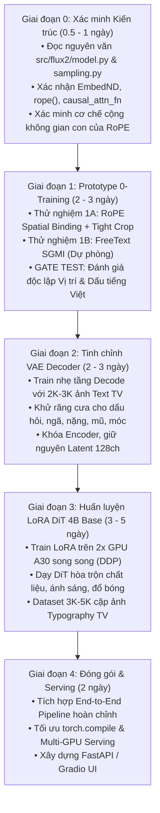

# 🚀 Lộ trình Dự án (v2): Nâng cấp FLUX.2 klein 4B Base Sinh chữ Tiếng Việt

- **Mục tiêu**: Tối ưu hóa năng lực vẽ chữ tiếng Việt có dấu ($100\%$ đúng chính tả, đủ dấu thanh/mũ) trên nền tảng **FLUX.2 [klein] 4B Base**.
- **Cấu hình phần cứng mục tiêu**: **2x NVIDIA A30 (24GB VRAM $\times 2 = 48$GB VRAM)**.
- **Phương pháp tiếp cận cốt lõi**: *Kiềng 3 chân bổ trợ (RoPE Binding + Tight Crop + LoRA DiT)*.

---

## 🏛️ Ma trận Kiềng 3 Chân: 3 Vấn đề $\leftrightarrow$ 3 Giải pháp tương hỗ

| Vấn đề kỹ thuật cốt lõi | Triệu chứng nếu không xử lý | Giải pháp kỹ thuật tương ứng | Chi phí / Phân loại |
| :--- | :--- | :--- | :---: |
| **Vấn đề 1: Vị trí (Spatial Binding)** | Chữ trôi tự do, dán đè như sticker lơ lửng, sai vị trí biển hiệu. | **RoPE Coordinate Binding** *(Gán tọa độ $h, w$ của ref-token trùng với canvas)* | 🏆 **0 Tham số** (Sửa logic tọa độ) |
| **Vấn đề 2: Chất liệu (Shape vs Texture)** | Chữ bị phẳng đơ (2D flat), mất ánh sáng 3D, mất chất liệu gỗ/neon/kim loại. | **LoRA trên DiT 4B Base** *(Dạy DiT lấy shape từ ref, lấy texture/lighting từ prompt/canvas)* | ⚙️ **LoRA Rank 16–32** (Train ở Giai đoạn 3) |
| **Vấn đề 3: Chi phí tính toán (Sequence Cost)** | Sequence dài 8.7K tokens $\rightarrow$ Attention $\mathcal{O}(N^2)$ làm chậm $3.5-4\times$. | **Tight Crop Glyph Preprocessing** *(Crop sát viền chữ, giữ $L_{\text{ref}} \le 256$ tokens)* | ⚡ **Tiền xử lý đồ họa** (0 tham số) |

> [!IMPORTANT]
> **Ba giải pháp này BỔ TRỢ CHO NHAU, KHÔNG THAY THẾ NHAU.** RoPE Binding giải quyết vị trí nhưng không giải quyết được chất liệu; Tight Crop giải quyết tốc độ; LoRA giải quyết độ tự nhiên của nét vẽ.

---

## 🗺️ Sơ đồ 5 Giai đoạn Triển khai (Bản v2)

---

## 📅 Chi tiết các Giai đoạn

### 📍 Giai đoạn 0: Xác minh kiến trúc (Gate bắt buộc trước khi code)
* **Thời gian**: `0.5 – 1 Ngày`
* **Công việc**:
  1. Đọc nguyên văn [`src/flux2/model.py`](file:///d:/Viettel%20Telecom/Tendoo%20AI/src/flux2/model.py) (`EmbedND`, `rope`, `apply_rope`, `causal_attn_fn`).
  2. Đọc nguyên văn [`src/flux2/sampling.py`](file:///d:/Viettel%20Telecom/Tendoo%20AI/src/flux2/sampling.py) (`encode_image_refs`, `prc_img`, `denoise_cfg`).
  3. Xác nhận tính phân rã cộng của các không gian con RoPE $(\Delta t, \Delta h, \Delta w, \Delta l)$.

---

### 📍 Giai đoạn 1: Prototype 0-Training (Thử 2 hướng song song)
* **Thời gian**: `2 – 3 Ngày`
* **1A (Hướng chính)**: RoPE Spatial Binding qua Native Ref-Token:
  * Render glyph tiếng Việt, **Crop sát viền chữ** ($L_{\text{ref}} \le 256$ tokens).
  * Gán tọa độ $(h, w)$ của ref-token trùng khớp với tọa độ canvas đích.
* **1B (Hướng dự phòng)**: FreeText-style hard latent injection (lọc phổ Log-Gabor + cosine annealing).
* **Tiêu chí nghiệm thu (Gate Test)**: Sinh 20 ảnh mẫu, đánh giá tách biệt:
  * *(a) Vị trí*: Chữ có bám đúng biển hiệu không?
  * *(b) Chính tả*: Dấu tiếng Việt có sắc nét không?

---

### 📍 Giai đoạn 2: Tinh chỉnh VAE Decoder
* **Thời gian**: `2 – 3 Ngày`
* **Công việc**:
  * Dataset: ~2,000 – 3,000 ảnh typography tiếng Việt chất lượng cao.
  * Đóng băng Encoder, mở gradient các block cuối của `Decoder`.
  * Hàm mất mát: $\mathcal{L} = \text{L1} + 0.5 \times \text{LPIPS}$. 1 GPU A30, hoàn thành trong ~3–5 giờ.

---

### 📍 Giai đoạn 3: Huấn luyện LoRA cho DiT 4B Base
* **Thời gian**: `3 – 5 Ngày`
* **Mục tiêu**:
  * Dạy DiT tách biệt hình dáng (Shape từ Ref) và chất liệu/ánh sáng (Texture từ Target).
  * LoRA Rank 16–32 trên các khối `DoubleStreamBlock` và `SingleStreamBlock`.
  * Chạy trên 2x GPU A30 song song (DDP / `accelerate`).

---

### 📍 Giai đoạn 4: Đóng gói Sản phẩm & Serving
* **Thời gian**: `2 Ngày`
* **Công việc**:
  * Ghép nối pipeline hoàn chỉnh, áp dụng `torch.compile`.
  * Phục vụ đa luồng trên 2x GPU A30 (FastAPI Backend / Gradio UI).
