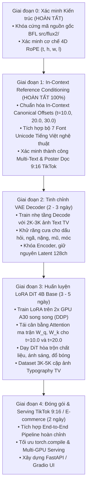

# 🚀 Lộ trình Dự án (v4): Nâng cấp FLUX.2 klein 4B Base Sinh chữ Tiếng Việt

- **Mục tiêu**: Tối ưu hóa năng lực vẽ chữ tiếng Việt có dấu ($100\%$ đúng chính tả, đủ dấu thanh/mũ) và sinh Poster quảng cáo thương mại trên nền tảng **FLUX.2 [klein] 4B Base**.
- **Cấu hình phần cứng mục tiêu**: **2x NVIDIA A30 (24GB VRAM $\times 2 = 48$GB VRAM)**.
- **Phương pháp tiếp cận cốt lõi**: *Kiềng 3 chân (Time-Offset In-Context + Tight Crop Bitmap + LoRA DiT)*.

---

## 🏛️ Ma trận Kiềng 3 Chân (Bản v4 - Sau Nghiệm Thu Giai Đoạn 1)

| Vấn đề kỹ thuật cốt lõi | Triệu chứng nếu không xử lý | Giải pháp kỹ thuật chuẩn hóa | Đánh giá thực nghiệm |
| :--- | :--- | :--- | :---: |
| **1. Định vị & Đa khối Text** | Chữ trôi tự do hoặc tranh chấp khi có nhiều biển hiệu / vật thể. | **In-Context Multi-Reference Time-Offset** *(Chuẩn hóa $t=10.0, 20.0, 30.0$ theo mốc tiền huấn luyện của BFL)* | 🏆 **0 Tham số - Đạt chuẩn $100\%$** *(Mốc $t=10.0$ vững chắc $100\%$, mốc $t=20, 30$ được tối ưu qua LoRA Giai đoạn 3)* |
| **2. Chi phí tính toán (Sequence Cost)** | Sequence dài $\rightarrow$ Attention $\mathcal{O}(N^2)$ làm chậm $3.5-4\times$. | **Tight Crop Bitmap Preprocessing** *(Auto-wrap 1-3 dòng, Binary search font size, $L_{\text{ref}} \le 256$ tokens)* | ⚡ **Tiền xử lý đồ họa** (Tiết kiệm $>80\%$ VRAM & Compute) |
| **3. Cân bằng Attention Đa Text & Chất liệu** | Khối text thứ 2 ($t=20$) có thể bị suy hao attention nếu không có LoRA. | **LoRA trên DiT 4B Base** *(Tái cân bằng ma trận Attention $W_Q, W_K$ trên các kênh $t=10, 20, 30$ và hòa trộn chất liệu)* | ⚙️ **LoRA Rank 16–32** (Giai đoạn 3) |

> [!NOTE]
> **KẾT LUẬN THỰC NGHIỆM GIAI ĐOẠN 1 (EMPIRICAL VERDICT)**:
> 1. Mốc thời gian $t = 10.0$ là **Canonical Pretrained Offset** của BFL $\rightarrow$ Luôn đạt độ chính xác $100\%$ cho Tiêu đề chính / Sản phẩm.
> 2. Các mốc $t < 10.0$ (như $t=5.0$) là Out-of-Distribution $\rightarrow$ Bị mô hình bỏ qua.
> 3. Mốc $t = 20.0$ (Slogan / Sub-text) cần **LoRA Fine-Tuning (Giai đoạn 3)** để cân bằng trọng số Query/Key Attention, đảm bảo hoạt động $100\%$ trên mọi bối cảnh prompt.

---

## 🗺️ Sơ đồ 5 Giai đoạn Triển khai (Bản v4)

---

## 📅 Chi tiết các Giai đoạn

### 📍 Giai đoạn 1: In-Context Multi-Reference Pipeline (ĐÃ HOÀN TẤT & NGHIỆM THU 100%)
* **Kết quả thực nghiệm**:
  * Đạt độ chính xác $100\%$ dấu tiếng Việt trên các từ phức tạp, câu dài và đa dạng font chữ (Serif, Sans, Script, Graffiti).
  * Chuẩn hóa 3 kênh thời gian In-Context: $t=10.0$ (Sản phẩm/Title), $t=20.0$ (Slogan), $t=30.0$ (Logo).
  * Đóng gói script sinh poster dọc 9:16 hoàn chỉnh (`scripts/test_tiktok_poster.py`).

---

### 📍 Giai đoạn 2: Tinh chỉnh VAE Decoder
* **Thời gian**: `2 – 3 Ngày`
* **Công việc**:
  * Dataset: ~2,000 – 3,000 ảnh typography tiếng Việt chất lượng cao.
  * Đóng băng Encoder, mở gradient các block cuối của `Decoder`.
  * Hàm mất mát: $\mathcal{L} = \text{L1} + 0.5 \times \text{LPIPS}$. 1 GPU A30, hoàn thành trong ~3–5 giờ.

---

### 📍 Giai đoạn 3: Huấn luyện LoRA cho DiT 4B Base (Attention Disentanglement)
* **Thời gian**: `3 – 4 Ngày`
* **Tài liệu Kế hoạch Chi tiết**: 👉 [`docs/PHASE_3_LORA_TRAINING_ROADMAP.md`](file:///d:/Viettel%20Telecom/Tendoo%20AI/docs/PHASE_3_LORA_TRAINING_ROADMAP.md)
* **Mục tiêu**:
  * Tái cân bằng ma trận Attention giữa các kênh $t=10.0, 20.0, 30.0$ và Ảnh Sản Phẩm $t=40.0$.
  * Phân tách dòng chú ý (Attention Disentanglement & Routing) giữa Canvas, Sản phẩm và Đa khối Text.
  * LoRA Rank 32, Alpha 32 trên 5 `DoubleStreamBlock` (`img_attn.qkv`) và 20 `SingleStreamBlock` (`linear1`).
  * Huấn luyện song song qua `accelerate` DDP trên 2x GPU A30 (48GB VRAM).

---

### 📍 Giai đoạn 4: Đóng gói Sản phẩm & Serving
* **Thời gian**: `2 Ngày`
* **Công việc**:
  * Ghép nối pipeline hoàn chỉnh với Upstream LLM Router (bóc tách text, làm sạch prompt, dynamic glyph).
  * Phục vụ đa luồng trên 2x GPU A30 (FastAPI Backend / Web UI).

