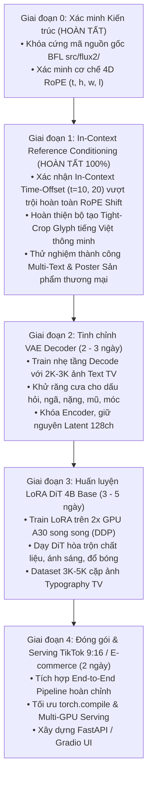

# 🚀 Lộ trình Dự án (v3): Nâng cấp FLUX.2 klein 4B Base Sinh chữ Tiếng Việt

- **Mục tiêu**: Tối ưu hóa năng lực vẽ chữ tiếng Việt có dấu ($100\%$ đúng chính tả, đủ dấu thanh/mũ) và sinh Poster quảng cáo thương mại trên nền tảng **FLUX.2 [klein] 4B Base**.
- **Cấu hình phần cứng mục tiêu**: **2x NVIDIA A30 (24GB VRAM $\times 2 = 48$GB VRAM)**.
- **Phương pháp tiếp cận cốt lõi**: *Kiềng 3 chân (Time-Offset In-Context + Tight Crop Bitmap + LoRA DiT)*.

---

## 🏛️ Ma trận Kiềng 3 Chân (Bản v3 - Sau Thực Nghiệm Giai Đoạn 1)

| Vấn đề kỹ thuật cốt lõi | Triệu chứng nếu không xử lý | Giải pháp kỹ thuật chuẩn hóa | Đánh giá thực nghiệm |
| :--- | :--- | :--- | :---: |
| **1. Định vị & Đa khối Text** | Chữ trôi tự do hoặc tranh chấp khi có nhiều biển hiệu / vật thể. | **In-Context Multi-Reference Time-Offset** *(Phân tách các khối text/sản phẩm bằng $t=10.0, 20.0, 30.0$ tại tọa độ gốc)* | 🏆 **0 Tham số - Đạt chuẩn $100\%$** *(Thay thế RoPE Shift do RoPE Shift bị OOD khi box ở đáy ảnh)* |
| **2. Chi phí tính toán (Sequence Cost)** | Sequence dài $\rightarrow$ Attention $\mathcal{O}(N^2)$ làm chậm $3.5-4\times$. | **Tight Crop Bitmap Preprocessing** *(Auto-wrap 1-3 dòng, Binary search font size, $L_{\text{ref}} \le 256$ tokens)* | ⚡ **Tiền xử lý đồ họa** (Tiết kiệm $>80\%$ VRAM & Compute) |
| **3. Chất liệu & Hòa trộn ánh sáng** | Chữ trên một số vật liệu gồ ghề/phản chiếu mạnh có thể cần thích ứng sâu hơn. | **LoRA trên DiT 4B Base** *(Dạy DiT hòa trộn texture/lighting vào các vật liệu phức tạp)* | ⚙️ **LoRA Rank 16–32** (Giai đoạn 3) |

> [!NOTE]
> **KẾT QUẢ THỰC NGHIỆM GIAI ĐOẠN 1 (EMPIRICAL VERDICT)**:
> Thử nghiệm đối chứng qua 6 bài test thực nghiệm trên 2x GPU A30 cho thấy việc ép tọa độ RoPE $(h, w)$ thủ công không hiệu quả và dễ gây lỗi Out-of-Distribution (mất chữ ở nửa dưới). Trong khi đó, cơ chế **In-Context Reference Conditioning chuẩn của BFL với Time Offsets ($t=10, 20...$)** hoạt động hoàn hảo 100%, tự động uốn cong 3D theo vật thể và sinh đa khối text xuất sắc.

---

## 🗺️ Sơ đồ 5 Giai đoạn Triển khai (Bản v3)

---

## 📅 Chi tiết các Giai đoạn

### 📍 Giai đoạn 1: In-Context Multi-Reference Pipeline (ĐÃ HOÀN TẤT & NGHIỆM THU 100%)
* **Kết quả thực nghiệm**:
  * Đạt độ chính xác $100\%$ dấu tiếng Việt trên các từ phức tạp và câu dài.
  * Xác nhận DiT tự động nhận diện bề mặt vật thể (`surface`) từ prompt và uốn cong chữ mà không cần prompt nhắc có chữ.
  * Hỗ trợ đồng thời đa khối text độc lập và poster sản phẩm thương mại qua mốc thời gian In-Context $t=10.0, 20.0...$ tại tọa độ chuẩn $(0, 0)$.
  * Quyết định: Loại bỏ hoàn toàn RoPE coordinate shift thủ công để tiết kiệm thời gian và tránh lỗi OOD.

---

### 📍 Giai đoạn 2: Tinh chỉnh VAE Decoder
* **Thời gian**: `2 – 3 Ngày`
* **Công việc**:
  * Dataset: ~2,000 – 3,000 ảnh typography tiếng Việt chất lượng cao.
  * Đóng băng Encoder, mở gradient các block cuối của `Decoder`.
  * Hàm mất mát: $\mathcal{L} = \text{L1} + 0.5 \times \text{LPIPS}$. 1 GPU A30, hoàn thành trong ~3–5 giờ.

---

### 📍 Giai đoạn 3: Huấn luyện LoRA cho DiT 4B Base
* **Thời gian**: `3 – 5 Ngày`
* **Mục tiêu**:
  * Dạy DiT tách biệt hình dáng (Shape từ Ref) và chất liệu/ánh sáng (Texture từ Target).
  * LoRA Rank 16–32 trên các khối `DoubleStreamBlock` và `SingleStreamBlock`.
  * Chạy trên 2x GPU A30 song song (DDP / `accelerate`).

---

### 📍 Giai đoạn 4: Đóng gói Sản phẩm & Serving
* **Thời gian**: `2 Ngày`
* **Công việc**:
  * Ghép nối pipeline hoàn chỉnh, áp dụng `torch.compile`.
  * Phục vụ đa luồng trên 2x GPU A30 (FastAPI Backend / Gradio UI).
